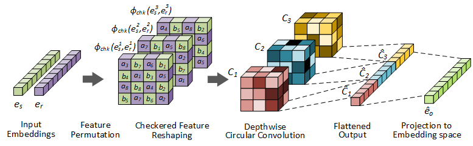

<h1 align="center">
  InteractE
</h1>
<h4 align="center">Improving Convolution-based Knowledge Graph Embeddings by Increasing Feature Interactions</h4>
<p align="center">
  <a href="https://aaai.org/Conferences/AAAI-20/"></a>
  <a href="https://arxiv.org/abs/1911.00219"></a>
  <a href="https://shikhar-vashishth.github.io/assets/pdf/interacte_supp.pdf"></a>
  <a href="https://github.com/malllabiisc/InteractE/blob/master/LICENSE">
    
  </a>
</p>

<h2 align="center">
  Overview of InteractE
</h2>

Given entity and relation embeddings, InteractE generates multiple permutations of these embeddings and reshapes them using a "Chequered" reshaping function. Depthwise circular convolution is employed to convolve each of the reshaped permutations, which are then fed to a fully-connected layer to compute scores. Please refer to Section 6 of the paper for details.*

### Dependencies

- Compatible with PyTorch 1.0 and Python 3.x.
- Dependencies can be installed using `requirements.txt`.

### Dataset:

- We use FB15k-237,  WN18RR and YAGO3-10 datasets for evaluation. 
- FB15k-237,  WN18RR are included in the repo. YAGO3-10 can be downloaded from [here](https://drive.google.com/drive/folders/186yl5MetAx_ialN0fOCvrtnBiKRJdzXO?usp=sharing). 

### Training model from scratch:

- Install all the requirements from `requirements.txt.`

- Execute `sh preprocess.sh` for extracting the datasets and setting up the environment. 

- To start training **InteractE** run:

  ```shell
  # FB15k-237
  python interacte.py --data FB15k-237 --gpu 0 --name fb15k_237_run
  
  # WN18RR
  python interacte.py --data WN18RR --batch 256 --train_strategy one_to_n --feat_drop 0.2 --hid_drop 0.3 --perm 4 --ker_sz 11 --lr 0.001
  
  # YAGO03-10
  python interacte.py --data YAGO3-10 --batch 128 --train_strategy one_to_n  --feat_drop 0.2 --hid_drop 0.3 
  ```
  - `data` indicates the dataset used for training the model. Other options are `WN18RR` and `YAGO3-10`.
  - `gpu` is the GPU used for training the model.
  - `name` is the provided name of the run which can be later used for restoring the model.
  - Execute `python interacte.py --help` for listing all the available options.

### Evaluating Pre-trained model:

* Execute `sh preprocess.sh` for extracting the datasets and setting up the environment. 

* Download the pre-trained model from [here](https://drive.google.com/open?id=1ffwqdnJFm1A14n7Cph7XVXX6TKY4BOv1) and place in `torch_saved` directory. 

* To restore and evaluate run:

  ```shell
  python interacte.py --data FB15k-237 --gpu 0 --name fb15k_237_pretrained --restore --epoch 0
  ```

### Citation:
Please cite the following paper if you use this code in your work.

```bibtex
@article{interacte2020,
       author = {{Vashishth}, Shikhar and {Sanyal}, Soumya and {Nitin}, Vikram and
         {Agrawal}, Nilesh and {Talukdar}, Partha},
        title = "{InteractE: Improving Convolution-based Knowledge Graph Embeddings by Increasing Feature Interactions}",
      journal = {arXiv e-prints},
     keywords = {Computer Science - Machine Learning, Statistics - Machine Learning},
         year = "2019",
        month = "Nov",
          eid = {arXiv:1911.00219},
        pages = {arXiv:1911.00219},
archivePrefix = {arXiv},
       eprint = {1911.00219},
 primaryClass = {cs.LG},
       adsurl = {https://ui.adsabs.harvard.edu/abs/2019arXiv191100219V},
      adsnote = {Provided by the SAO/NASA Astrophysics Data System}
}
```

For any clarification, comments, or suggestions please create an issue or contact [Shikhar](http://shikhar-vashishth.github.io).
